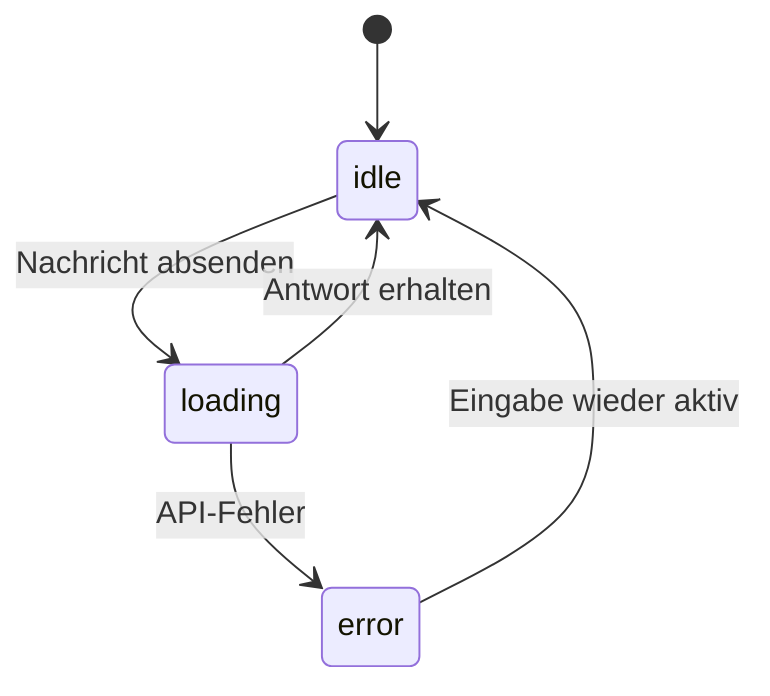
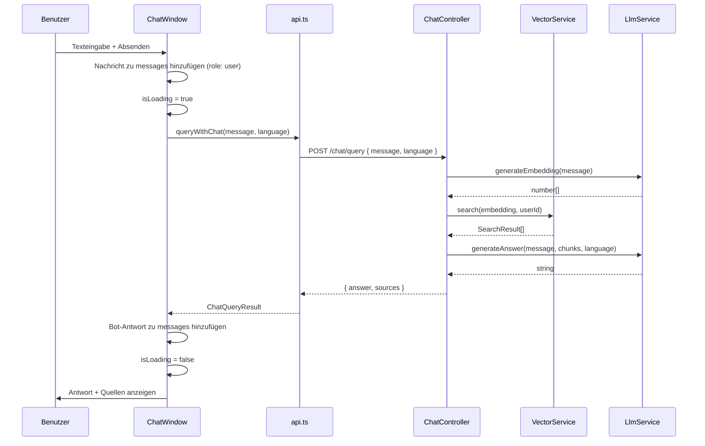

# Design-Dokument: Text-Chatbot

## Übersicht

Der Text-Chatbot ergänzt die bestehende Spracheingabe (`VoiceInput`) um eine textbasierte Eingabemöglichkeit. Ein neuer Chat-Button öffnet ein Chatfenster, über das der Benutzer Fragen eintippen und Antworten des LLM-gestützten Assistenten lesen kann. Die RAG-Pipeline (Vektorsuche + LLM) wird unverändert wiederverwendet – lediglich STT und TTS entfallen.

---

## Architektur

```mermaid
graph TD
    A[App.tsx] -->|rendert| B[ChatInput-Button]
    B -->|Toggle| C[ChatWindow.tsx]
    C -->|queryWithChat()| D[api.ts]
    D -->|POST /chat/query + JWT| E[ChatController]
    E -->|generateEmbedding + generateAnswer| F[LlmService]
    E -->|search| G[VectorService]
    F -->|HTTP fetch| H[Ollama llama3]
    G -->|Milvus SDK| I[Milvus]
```

Der neue `ChatController` folgt exakt dem Muster des bestehenden `VoiceController`, verzichtet aber auf `SttService` und `TtsService`.

---

## Backend-Design

### ChatController

Datei: `backend/src/controllers/chat.controller.ts`

```typescript
@ApiTags('chat')
@ApiBearerAuth()
@UseGuards(JwtAuthGuard)
@Controller('chat')
export class ChatController {
  constructor(
    private readonly llmService: LlmService,
    private readonly vectorService: VectorService,
  ) {}

  @Post('query')
  @ApiOperation({ summary: 'Text Q&A across all user documents' })
  async chatQuery(
    @Body() dto: ChatQueryDto,
    @CurrentUser() user: AuthenticatedUser,
  ): Promise<ChatQueryResult> { ... }
}
```

### ChatQueryDto

Datei: `backend/src/controllers/chat.controller.ts` (inline oder eigene Datei)

```typescript
export class ChatQueryDto {
  @IsString()
  @IsNotEmpty()
  message: string;

  @IsOptional()
  @IsIn(['en', 'de'])
  language?: SupportedLanguage;
}
```

Validierung erfolgt über `class-validator` (bereits im Projekt vorhanden). Bei leerem `message` antwortet NestJS automatisch mit HTTP 400.

### Integration in AppModule

`ChatController` wird direkt in `AppModule` registriert – analog zu `VoiceController`. Kein separates Modul nötig, da `LlmService` und `VectorService` bereits als Provider vorhanden sind.

```typescript
// app.module.ts – Ergänzungen
controllers: [..., ChatController],
// Keine neuen Provider nötig
```

### Antwortformat

```typescript
// backend/src/types/index.ts – neu hinzufügen
export interface ChatQueryResult {
  answer: string;
  sources: Array<{
    documentId: string;
    filename: string;
    chunkText: string;
    similarity: number;
  }>;
}
```

### Fehlerbehandlung Backend

| Situation               | HTTP-Status | Verhalten                                                      |
| ----------------------- | ----------- | -------------------------------------------------------------- |
| Kein JWT                | 401         | `JwtAuthGuard` wirft `UnauthorizedException`                   |
| Leeres `message`        | 400         | `ValidationPipe` wirft `BadRequestException`                   |
| LLM nicht erreichbar    | 503         | `LlmService` wirft `ServiceUnavailableException`               |
| Milvus nicht erreichbar | 503         | `VectorService` gibt leere Liste zurück (graceful degradation) |

---

## Frontend-Design

### Neue Typen

Datei: `frontend/src/types/types.ts` – Ergänzungen:

```typescript
export interface ChatMessage {
  id: string; // crypto.randomUUID()
  role: 'user' | 'bot';
  text: string;
  sources?: Array<{
    documentId: string;
    filename: string;
    chunkText: string;
    similarity: number;
  }>;
  timestamp: Date;
}

export interface ChatQueryResult {
  answer: string;
  sources: Array<{
    documentId: string;
    filename: string;
    chunkText: string;
    similarity: number;
  }>;
}
```

### API-Funktion

Datei: `frontend/src/services/api.ts` – neue Funktion:

```typescript
export async function queryWithChat(
  message: string,
  language?: SupportedLanguage,
): Promise<ChatQueryResult> {
  const res = await api.post<ChatQueryResult>('/chat/query', { message, language });
  return res.data;
}
```

### ChatWindow-Komponente

Datei: `frontend/src/components/ChatWindow.tsx`

State:

- `messages: ChatMessage[]` – Konversationsverlauf der Sitzung
- `input: string` – aktueller Eingabetext
- `isLoading: boolean` – Anfrage läuft

Verhalten:

- Nachrichten werden in chronologischer Reihenfolge gerendert
- User-Nachrichten: rechtsbündig, blauer Hintergrund
- Bot-Antworten: linksbündig, grauer Hintergrund
- Quellen werden unterhalb der Bot-Antwort angezeigt (nur wenn `sources.length > 0`)
- Auto-Scroll zum Ende bei neuer Nachricht via `useRef` + `scrollIntoView`
- Ladeindikator (animierter Punkt) während `isLoading === true`
- Eingabefeld und Senden-Button sind während `isLoading` disabled
- Leere / Whitespace-only Eingaben werden nicht abgesendet
- Schließen-Button oben rechts
- Löschen-Button für den Konversationsverlauf



### Platzierung in App.tsx

Der Chat-Button wird neben `VoiceInput` im "Ask a Question"-Bereich platziert:

```tsx
{/* Voice Q&A */}
<div className="bg-white rounded-xl shadow-sm p-6">
  <h2 className="font-semibold text-gray-700 mb-4">Ask a Question</h2>
  <div className="flex items-center gap-6 justify-center">
    <VoiceInput ... />
    <ChatButton onClick={() => setChatOpen(true)} />
  </div>
</div>

{chatOpen && (
  <ChatWindow
    language={language}
    onClose={() => setChatOpen(false)}
  />
)}
```

`chatOpen: boolean` wird als neuer State in `App.tsx` gehalten. Das Chatfenster wird als Overlay/Modal über dem Hauptinhalt gerendert.

### State-Management

Der Konversationsverlauf (`messages`) lebt im State von `ChatWindow`. Da `ChatWindow` nur unmountet wird wenn `chatOpen === false`, bleibt der State erhalten solange die Komponente gemountet ist. Beim erneuten Öffnen (ohne Unmount) sind die Nachrichten noch vorhanden.

Alternativ: `messages`-State in `App.tsx` halten und als Prop übergeben – dann bleibt der Verlauf auch nach Unmount erhalten. Dies ist die robustere Lösung und wird empfohlen.

---

## Datenfluss



---

## Korrektheitseigenschaften

_Eine Eigenschaft (Property) ist ein Merkmal oder Verhalten, das für alle gültigen Ausführungen eines Systems gelten soll – im Wesentlichen eine formale Aussage darüber, was das System tun soll. Properties bilden die Brücke zwischen menschenlesbaren Spezifikationen und maschinell verifizierbaren Korrektheitsnachweisen._

### Property 1: Chat-Button Toggle

_Für jeden_ Zustand des Chat-Buttons (offen/geschlossen): Ein Klick auf den Button invertiert den Sichtbarkeitszustand des Chatfensters. Zwei aufeinanderfolgende Klicks führen zum ursprünglichen Zustand zurück (Round-Trip).

**Validates: Requirements 1.2, 1.3**

---

### Property 2: Chronologische Nachrichtenreihenfolge

_Für jede_ beliebige Sequenz von Nachrichten, die dem Konversationsverlauf hinzugefügt werden: Die Anzeigereihenfolge im Chatfenster entspricht der Einfügereihenfolge (Index i kommt vor Index i+1).

**Validates: Requirements 2.1**

---

### Property 3: Visuelle Unterscheidbarkeit von Nachrichten

_Für jede_ Nachricht im Konversationsverlauf: User-Nachrichten (`role: 'user'`) und Bot-Antworten (`role: 'bot'`) erhalten unterschiedliche CSS-Klassen, sodass sie visuell unterscheidbar sind.

**Validates: Requirements 2.2**

---

### Property 4: Absenden leert das Eingabefeld

_Für jede_ nicht-leere Texteingabe: Nach dem Absenden (Enter oder Button-Klick) ist das Eingabefeld leer.

**Validates: Requirements 3.2, 3.3, 3.4**

---

### Property 5: Leere Eingaben werden abgelehnt

_Für jeden_ String, der ausschließlich aus Whitespace-Zeichen besteht (einschließlich des leeren Strings): Das Absenden wird verhindert und die Nachrichtenliste bleibt unverändert.

**Validates: Requirements 3.5**

---

### Property 6: Gültige Anfragen rufen RAG-Pipeline auf

_Für jede_ gültige Chat-Anfrage (nicht-leeres `message`, gültiges JWT): Der `ChatController` ruft sowohl `VectorService.search()` als auch `LlmService.generateAnswer()` auf, und die Antwort enthält die Felder `answer` (string) und `sources` (array).

**Validates: Requirements 4.2, 4.3, 4.4**

---

### Property 7: Ungültige Eingaben werden mit HTTP 400 abgelehnt

_Für jeden_ Request-Body, bei dem `message` fehlt, leer ist oder nur Whitespace enthält: Der Endpunkt antwortet mit HTTP 400.

**Validates: Requirements 4.7**

---

### Property 8: Quellenanzeige abhängig von sources-Länge

_Für jede_ Bot-Antwort: Wenn `sources.length > 0`, wird der Quellenbereich mit Dateiname und Textausschnitt für jede Quelle angezeigt. Wenn `sources.length === 0`, wird kein Quellenbereich gerendert.

**Validates: Requirements 5.1, 5.2, 5.3**

---

### Property 9: Sprachparameter-Weiterleitung

_Für jede_ Chat-Anfrage mit einer konfigurierten Sprache (`en` oder `de`): Der `language`-Parameter wird unverändert von der Frontend-Anfrage bis zum Aufruf von `LlmService.generateAnswer()` durchgereicht.

**Validates: Requirements 6.1, 6.2, 6.3**

---

### Property 10: Fehlerbehandlung reaktiviert Eingabe

_Für jeden_ API-Fehler (HTTP-Fehler oder Netzwerkfehler): Eine Fehlermeldung wird im Chatfenster angezeigt, und das Eingabefeld sowie der Senden-Button werden wieder aktiviert (`disabled = false`).

**Validates: Requirements 7.1, 7.2, 7.3**

---

### Property 11: Konversationsverlauf-Persistenz

_Für jede_ Sequenz von Nachrichten: Nach dem Schließen und erneuten Öffnen des Chatfensters (ohne Seitenreload) sind alle zuvor hinzugefügten Nachrichten noch im State vorhanden.

**Validates: Requirements 8.1, 8.2**

---

### Property 12: Löschen leert den Konversationsverlauf

_Für jeden_ nicht-leeren Konversationsverlauf: Nach dem Klick auf den Löschen-Button ist die Nachrichtenliste leer.

**Validates: Requirements 8.4**

---

### Property 13: Kein TTS-Aufruf bei Chat-Anfragen

_Für jede_ Anfrage an `POST /chat/query`: `TtsService.synthesize()` wird nicht aufgerufen, und die Antwort enthält kein `audioUrl`-Feld.

**Validates: Requirements 9.2, 9.3**

---

## Fehlerbehandlung

### Backend

- `ValidationPipe` (global in `main.ts`) fängt DTO-Validierungsfehler ab → HTTP 400
- `JwtAuthGuard` → HTTP 401 bei fehlendem/ungültigem Token
- `LlmService` wirft `ServiceUnavailableException` → HTTP 503
- `VectorService` degradiert graceful bei Milvus-Ausfall (leere Ergebnisliste)
- `AllExceptionsFilter` (bereits vorhanden) fängt alle unbehandelten Fehler ab

### Frontend

- Axios-Fehler werden in `ChatWindow` im `catch`-Block abgefangen
- Fehlermeldung wird als Bot-Nachricht mit `role: 'bot'` und Fehlertext in die Nachrichtenliste eingefügt
- `isLoading` wird auf `false` gesetzt, Eingabefeld wird reaktiviert
- Netzwerkfehler (kein `response`) werden separat behandelt

---

## Testing-Strategie

### Dualer Ansatz

Beide Testarten sind komplementär und notwendig:

- **Unit-Tests**: Spezifische Beispiele, Edge Cases, Fehlerszenarien
- **Property-Tests**: Universelle Eigenschaften über viele generierte Eingaben

### Backend Unit-Tests (Vitest)

Datei: `backend/tests/unit/chat.controller.spec.ts`

- Beispiel: `POST /chat/query` mit gültigem Body → 200 + `{ answer, sources }`
- Beispiel: `POST /chat/query` ohne JWT → 401
- Beispiel: `POST /chat/query` mit leerem `message` → 400
- Beispiel: LLM nicht erreichbar → 503
- Edge Case: `message` nur Whitespace → 400

### Backend Property-Tests (Vitest + fast-check)

`fast-check` wird als Property-Testing-Bibliothek verwendet (für Node.js/TypeScript etabliert, kompatibel mit Vitest).

Installation: `npm install --save-dev fast-check` im Backend.

Datei: `backend/tests/unit/chat.controller.property.spec.ts`

Jeder Property-Test läuft mit mindestens 100 Iterationen.

```
// Feature: text-chatbot, Property 6: Gültige Anfragen rufen RAG-Pipeline auf
// Feature: text-chatbot, Property 7: Ungültige Eingaben werden mit HTTP 400 abgelehnt
// Feature: text-chatbot, Property 9: Sprachparameter-Weiterleitung
// Feature: text-chatbot, Property 13: Kein TTS-Aufruf bei Chat-Anfragen
```

### Frontend Unit-Tests (Vitest + Testing Library)

Datei: `frontend/tests/ChatWindow.spec.tsx`

- Beispiel: Chat-Button im DOM vorhanden mit `aria-label`
- Beispiel: Leere Nachrichtenliste → Hinweistext sichtbar
- Beispiel: Schließen-Button vorhanden
- Beispiel: Löschen-Button vorhanden
- Beispiel: Loading-Zustand → Eingabefeld und Button disabled, Ladeindikator sichtbar
- Beispiel: Antwort ohne Quellen → kein Quellenbereich

### Frontend Property-Tests (Vitest + fast-check)

Datei: `frontend/tests/ChatWindow.property.spec.tsx`

```
// Feature: text-chatbot, Property 1: Chat-Button Toggle
// Feature: text-chatbot, Property 2: Chronologische Nachrichtenreihenfolge
// Feature: text-chatbot, Property 3: Visuelle Unterscheidbarkeit von Nachrichten
// Feature: text-chatbot, Property 4: Absenden leert das Eingabefeld
// Feature: text-chatbot, Property 5: Leere Eingaben werden abgelehnt
// Feature: text-chatbot, Property 8: Quellenanzeige abhängig von sources-Länge
// Feature: text-chatbot, Property 10: Fehlerbehandlung reaktiviert Eingabe
// Feature: text-chatbot, Property 11: Konversationsverlauf-Persistenz
// Feature: text-chatbot, Property 12: Löschen leert den Konversationsverlauf
```

Jeder Property-Test läuft mit mindestens 100 Iterationen (`{ numRuns: 100 }`).

### Fehlende Abhängigkeit

`fast-check` ist noch nicht im Projekt vorhanden und muss in beiden Paketen installiert werden:

```bash
# Backend
cd backend && npm install --save-dev fast-check

# Frontend
cd frontend && npm install --save-dev fast-check
```
